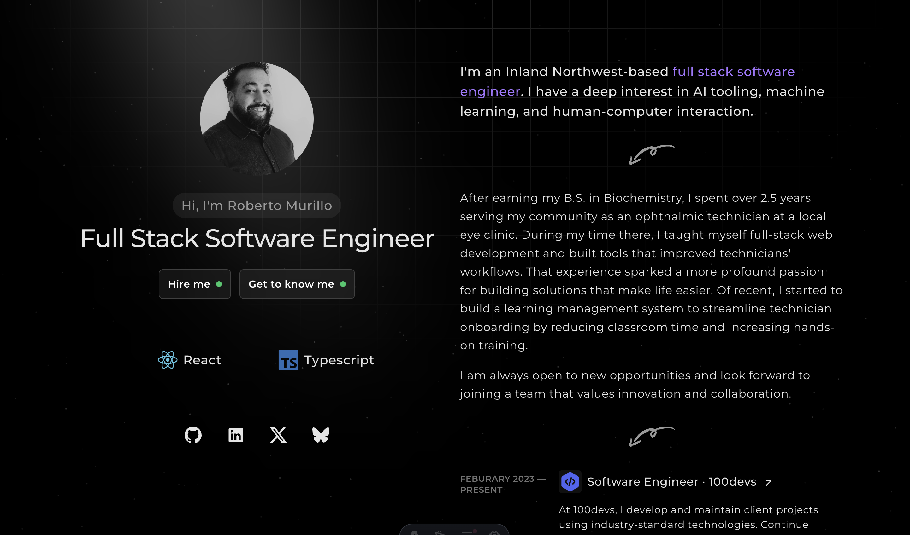
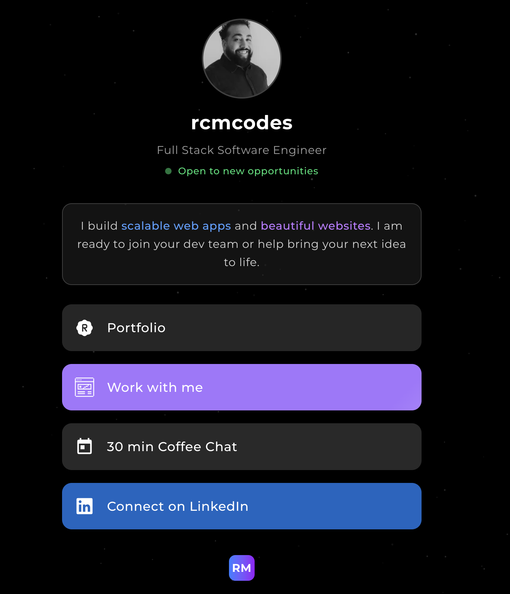
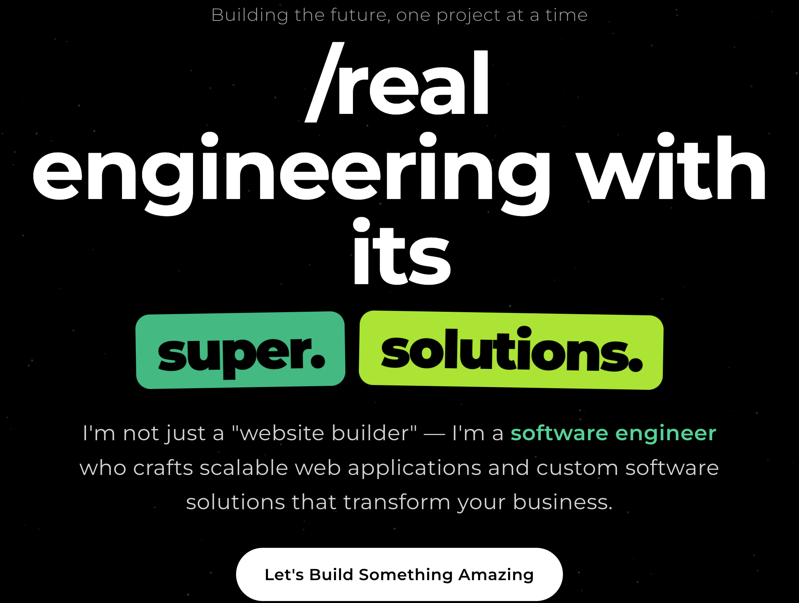

<h2 align="center">
  
Personal Portfolio Website

  <a href="https://rcmcodes.com" target="_blank">🌐 Visit rcmcodes.com</a>
</h2>

  
  
  
  

## ✨ Key Features

**Portfolio Showcase**
- Featured projects including TransposeRx (ophthalmic prescription tool), Technician's Bootcamp (healthcare LMS), and IntelFlow (no-code AI pipeline builder)
- Professional experience timeline highlighting roles at 100devs, Spokane Eye Clinic, and Twin Rocks Web Development
- Speaking engagements and technical presentations

**Built for Performance**
- Lightning-fast load times with Astro's static site generation
- Optimized images and minimal JavaScript
- Perfect Lighthouse scores across all metrics

**Connect & Collaborate**
- [Professional Links Hub](https://rcmcodes.com/links) - All social and professional links in one place
- [Partnership Opportunities](https://rcmcodes.com/partner) - Collaboration and consulting inquiries
- Direct calendar booking integration for coffee chats and consultations

## 🔗 Quick Links

- **Website**: [rcmcodes.com](https://rcmcodes.com)
- **GitHub**: [github.com/rcm-webdev](https://github.com/rcm-webdev)
- **LinkedIn**: [linkedin.com/in/roberto-c-murillo](https://www.linkedin.com/in/roberto-c-murillo/)
- **Twitter/X**: [@rcmwdev](https://x.com/rcmwdev)

## 🎨 Tech Highlights

Built with modern web technologies for optimal performance:
- **Framework**: Astro with TypeScript
- **Styling**: Tailwind CSS
- **Integrations**: Cal.com booking, custom cursor effects
- **Deployment**: Optimized for Netlify with perfect SEO scores

Code is licensed under MIT, words and images are licensed under <a href='https://creativecommons.org/licenses/by-nc-sa/4.0/'>CC BY-NC-SA 4.0</a>.

